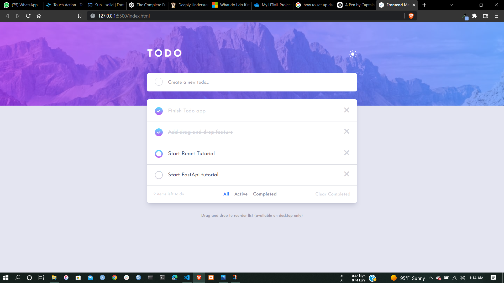
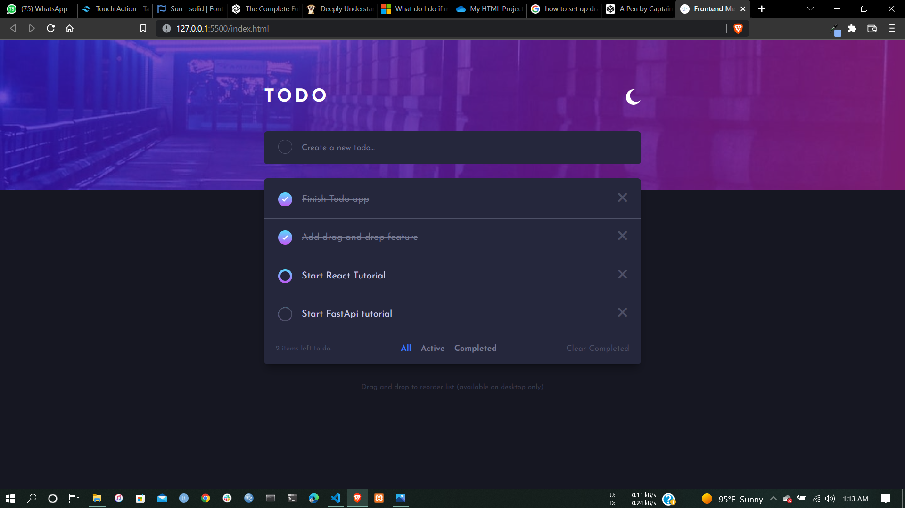
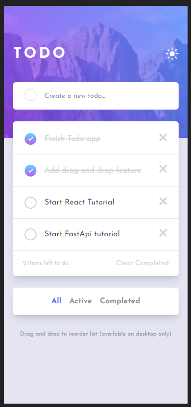
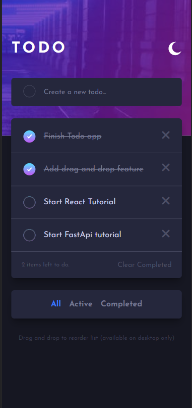

# Toby's Todo

Toby's todo is a productivity app built with the MERN stack and TailwindCSS with authentication, authorization, CRUD ops and filtering.

## Built With

- MongoDB
- Express
- Node.JS
- React.JS
- RTK
- RTKQuery
- Mongoose.JS
- TailwindCSS

## Installation

To work with or inspect the code base

- Clone the repo

```bash
git clone git@github.com:Toby2507/toby-s-todo.git
```

- Install dependencies

```bash
npm install
```

## Screenshots






## Links

- [Live Site URL](https://tobystodo.netlify.app)

## Contributing

Pull requests are welcome. For major changes, please open an issue first to discuss what you would like to change.
